

    

         
        
    

         
    

        
	

            
    数据库系统: PROJECT
    
 

     
     
    <table style="border:none;text-align:center;width:72%;font-family:仿宋;font-size:14px; margin: 0 auto;">
    <tbody style="font-family:方正公文仿宋;font-size:12pt;">
    	<tr style="font-weight:normal;"> 
    		<td style="width:20%;text-align:right;">题　　目</td>
    		<td style="width:2%">：</td> 
    		<td style="width:40%;font-weight:normal;border-bottom: 1px solid;text-align:center;font-family:华文仿宋"> MiniSQL</td>     </tr>
    	<tr style="font-weight:normal;"> 
    		<td style="width:20%;text-align:right;">授课教师</td>
    		<td style="width:2%">：</td> 
    		<td style="width:40%;font-weight:normal;border-bottom: 1px solid;text-align:center;font-family:华文仿宋">周波 </td>     </tr>
    	<tr style="font-weight:normal;"> 
    		<td style="width:20%;text-align:right;">姓　　名</td>
    		<td style="width:2%">：</td> 
    		<td style="width:40%;font-weight:normal;border-bottom: 1px solid;text-align:center;font-family:华文仿宋"> 陈奕萱 焦洋</td>     </tr>
    	<tr style="font-weight:normal;"> 
    		<td style="width:20%;text-align:right;">学　　号</td>
    		<td style="width:2%">：</td> 
    		<td style="width:40%;font-weight:normal;border-bottom: 1px solid;text-align:center;font-family:华文仿宋">3220102866 3220102087 </td>     </tr>
    	<tr style="font-weight:normal;"> 
    		<td style="width:20%;text-align:right;">日　　期</td>
    		<td style="width:2%">：</td> 
    		<td style="width:40%;font-weight:normal;border-bottom: 1px solid;text-align:center;font-family:华文仿宋">2024-06-10</td>     </tr>
    </tbody>              
    </table>

 目录

  

[toc]

## 1 实验目的

1. 设计并实现一个精简型单用户SQL引擎MiniSQL，允许用户通过字符界面输入SQL语句实现基本的增删改查操作，并能够通过索引来优化性能。
2. 通过对MiniSQL的设计与实现，提高学生的系统编程能力，加深对数据库管理系统底层设计的理解。

## 2 实验需求

1. 数据类型：要求支持三种基本数据类型：`integer`，`char(n)`，`float`。
2. 表定义：一个表可以定义多达32个属性，各属性可以指定是否为`unique`，支持单属性的主键定义。
3. 索引定义：对于表的主属性自动建立B+树索引，对于声明为`unique`的属性也需要建立B+树索引。
4. 数据操作: 可以通过`and`或`or`连接的多个条件进行查询，支持等值查询和区间查询。支持每次一条记录的插入操作；支持每次一条或多条记录的删除操作。
5. 在工程实现上，使用源代码管理工具（如Git）进行代码管理，代码提交历史和每次提交的信息清晰明确；同时编写的代码应符合代码规范，具有良好的代码风格。

## 3 实验平台

### 3.1 代码框架

本实验基于CMU-15445 BusTub框架，课程组做了一些修改和扩展。

### 3.2 编译&开发环境

>  使用WSL-Ubuntu + CLion进行开发

- `gcc`&`g++` : 8.0+ (Linux)，使用`gcc --version`和`g++ --version`查看

- `cmake`: 3.16+ (Both)，使用`cmake --version`查看

- `gdb`: 7.0+ (Optional)，使用`gdb --version`查看

 

- `flex`& `bison`（暂时不需要安装，但如果需要对SQL编译器的语法进行修改，需要安装）

CLion配置：

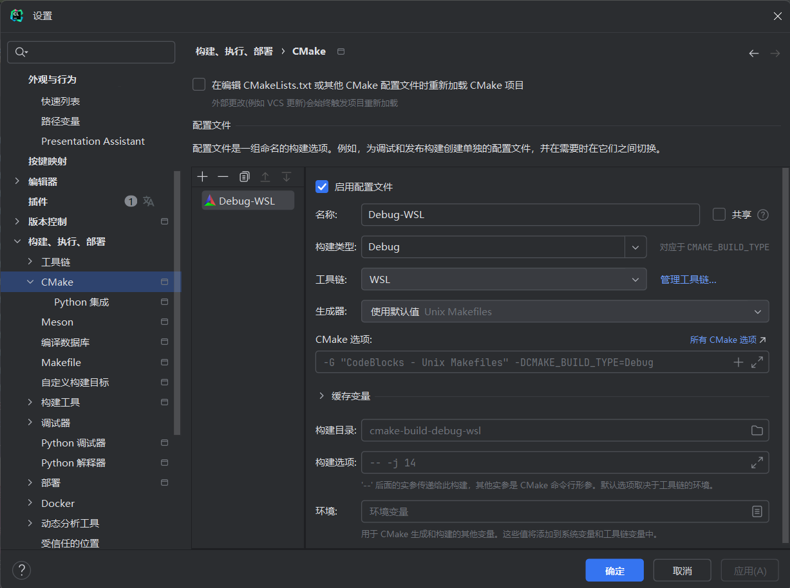

## 4 实验模块

### 4.1 DISK AND BUFFER POOL MANAGER

#### 4.1.1 概述

第一个模块包含了四个部分，分别是

- 位图页实现
- 磁盘数据页管理
- 缓冲池替换策略
    - LRU替换策略
    - **(Bonus)** CLOCK替换策略
- 缓冲池管理

**它这个底下是这么分的，我不太清楚，要是你不好写应该也可以不这么分吧**

#### 4.2.2 Bitmap 实现

待完善

#### 4.2.3 磁盘数据页管理

待完善

#### 4.2.4 LRU替换策略

待完善

#### 4.2.5 缓冲池管理

待完善

#### 4.2.6 测试结果

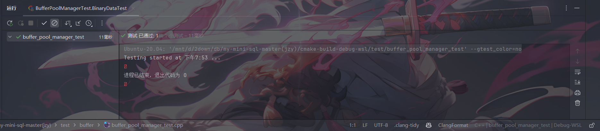

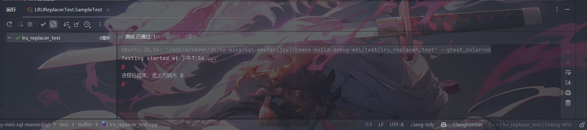

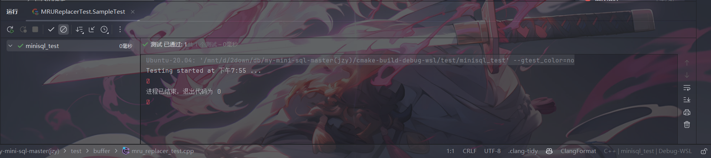

#### 4.2.7 思考题
（要是没思考题这里删了）

### 4.2 RECORD MANAGER

#### 4.2.1 概述

​	在MiniSQL的设计中，Record Manager负责管理数据表中所有的记录，它能够支持记录的插入、删除与查找操作，并对外提供相应的接口。

​	与记录（Record）相关的概念有以下几个：

- 列（`Column`）：在`src/include/record/column.h`中被定义，用于定义和表示数据表中的某一个字段，即包含了这个字段的字段名、字段类型、是否唯一等等；
- 模式（`Schema`）：在`src/include/record/schema.h`中被定义，用于表示一个数据表或是一个索引的结构。一个`Schema`由一个或多个的`Column`构成；
- 域（`Field`）：在`src/include/record/field.h`中被定义，它对应于一条记录中某一个字段的数据信息，如存储数据的数据类型，是否是空，存储数据的值等等；
- 行（`Row`）：在`src/include/record/row.h`中被定义，与元组的概念等价，用于存储记录或索引键，一个`Row`由一个或多个`Field`构成。

​	此外，与数据类型相关的定义和实现位于`src/include/record/types.h`中。

#### 4.2.2 记录与模式

#### 4.2.3 Row

#### 4.2.4 Column

#### 4.2.5 Schema

#### 4.2.6 堆表的实现

#### 4.2.7 测试结果

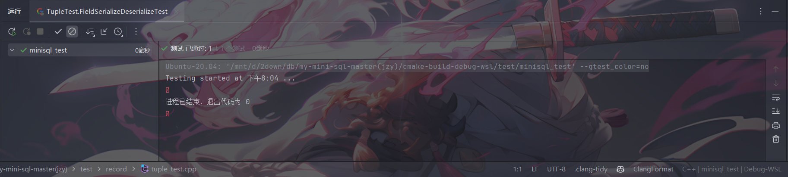

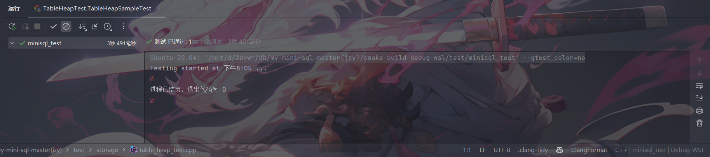

#### 4.2.8 思考题

### 4.3 INDEX MANAGER

#### 4.3.1 概述

Index Manager 负责数据表索引的实现和管理，包括：索引的创建和删除，索引键的等值查找，索引键的范围查找（返回对应的迭代器），以及插入和删除键值等操作，并对外提供相应的接口。

​通过遍历堆表的方式来查找一条记录是十分低效的，为了能够快速定位到某条记录而无需搜索数据表中的每一条记录，我们需要在上一个实验的基础上实现一个索引，这能够为快速随机查找和高效访问有序记录提供基础。索引有很多种实现方式，如B+树索引，Hash索引等等。在本模块中，我实现了一个基于磁盘的B+树动态索引结构。

#### 4.3.2 B+ 树数据页

#### 4.3.3 B+ 树索引

#### 4.3.4 B+ 树索引迭代器

#### 4.3.5 测试结果

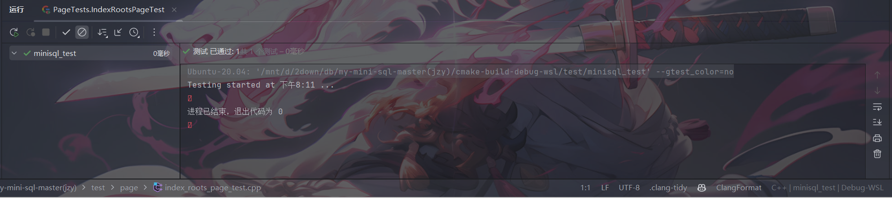

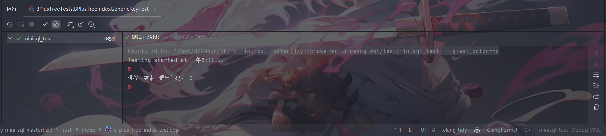

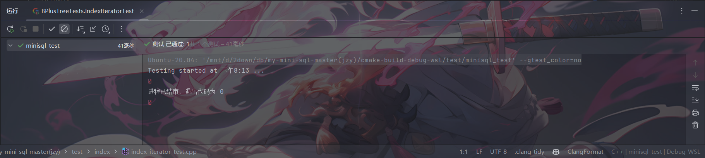

#### 4.3.6 思考题

### 4.4 CATALOG MANAGER

#### 4.4.1 概述

​	Catalog Manager 负责管理和维护数据库的所有模式信息，包括：

- 数据库中所有表的定义信息，包括表的名称、表中字段（列）数、主键、定义在该表上的索引。
- 表中每个字段的定义信息，包括字段类型、是否唯一等。
- 数据库中所有索引的定义，包括所属表、索引建立在那个字段上等。

#### 4.4.2 目录元信息

#### 4.4.3 表和索引的管理

#### 4.4.4 测试结果

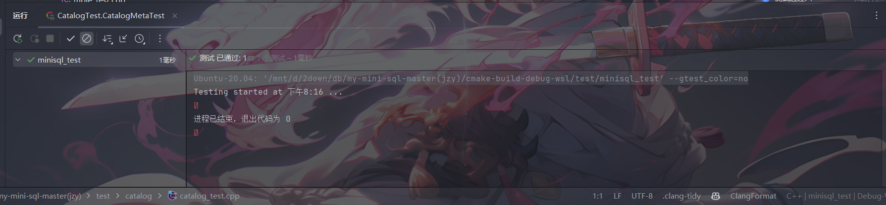

#### 4.4.5 思考题

### 4.5 PLANNER AND EXECUTOR

#### 4.5.1 概述

​	本模块主要包括Planner和Executor两部分。Planner的主要功能是将解释器（Parser）生成的语法树，改写成数据库可以理解的数据结构。在这个过程中，我们会将所有sql语句中的标识符（Identifier）解析成没有歧义的实体，即各种C++的类，并通过Catalog Manager 提供的信息生成执行计划。Executor遍历查询计划树，将树上的 `PlanNode `替换成对应的 Executor，随后调用 Record Manager、Index Manager 和 Catalog Manager 提供的相应接口进行执行，并将执行结果返回给上层。

#### 4.5.2 Parser生成语法树

#### 4.5.3 Executor执行查询计划

#### 4.5.4 SeqScan

#### 4.5.5 IndexScan

#### 4.5.6 Insert

#### 4.5.7 Value

#### 4.5.8 Update

#### 4.5.9 Delete

#### 4.5.10 无需查询计划的功能

#### 4.5.11 测试结果

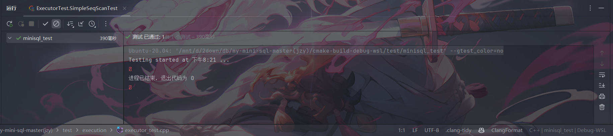

#### 4.5.12 思考题

### 4.6 RECOVERY MANAGER

（卧槽这一部分是新开的没有可以抄的了）

#### 4.6.1 概述

#### 4.6.2 数据恢复

#### 4.6.3 测试结果

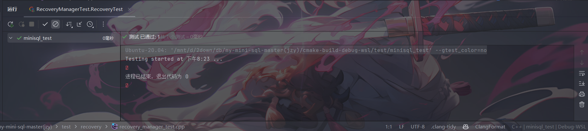

#### 4.6.4 思考题

## 5 项目测试

### 5.1 模块正确性测试 main_test.cpp

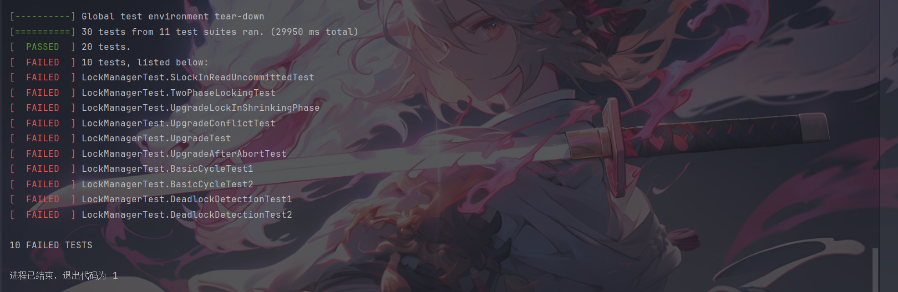
